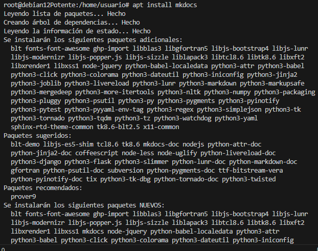
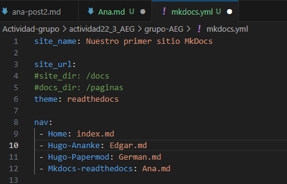
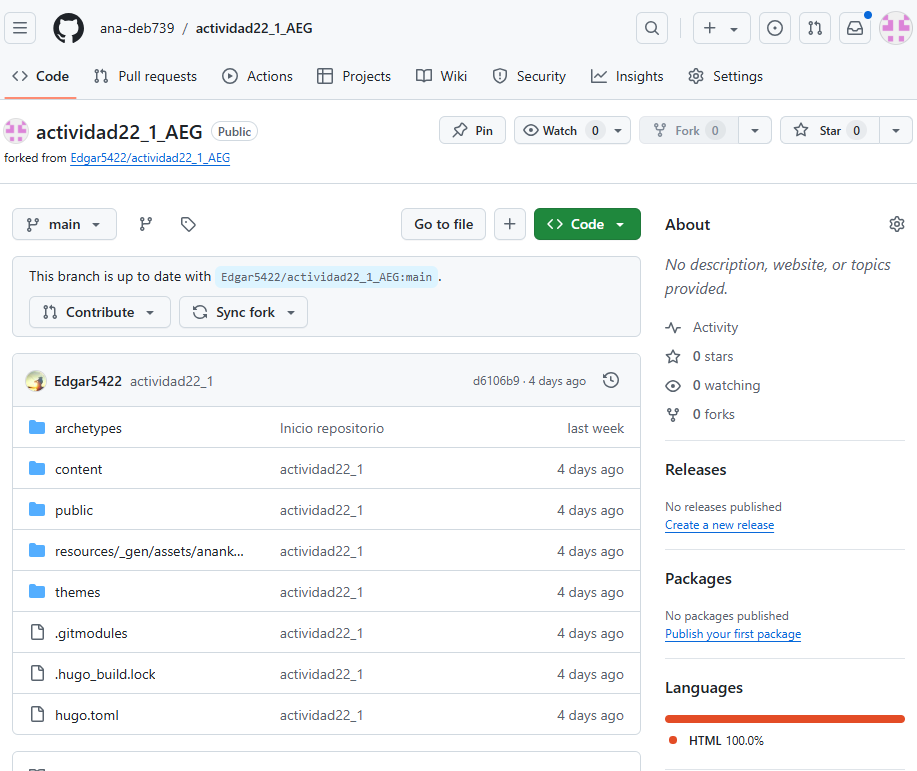
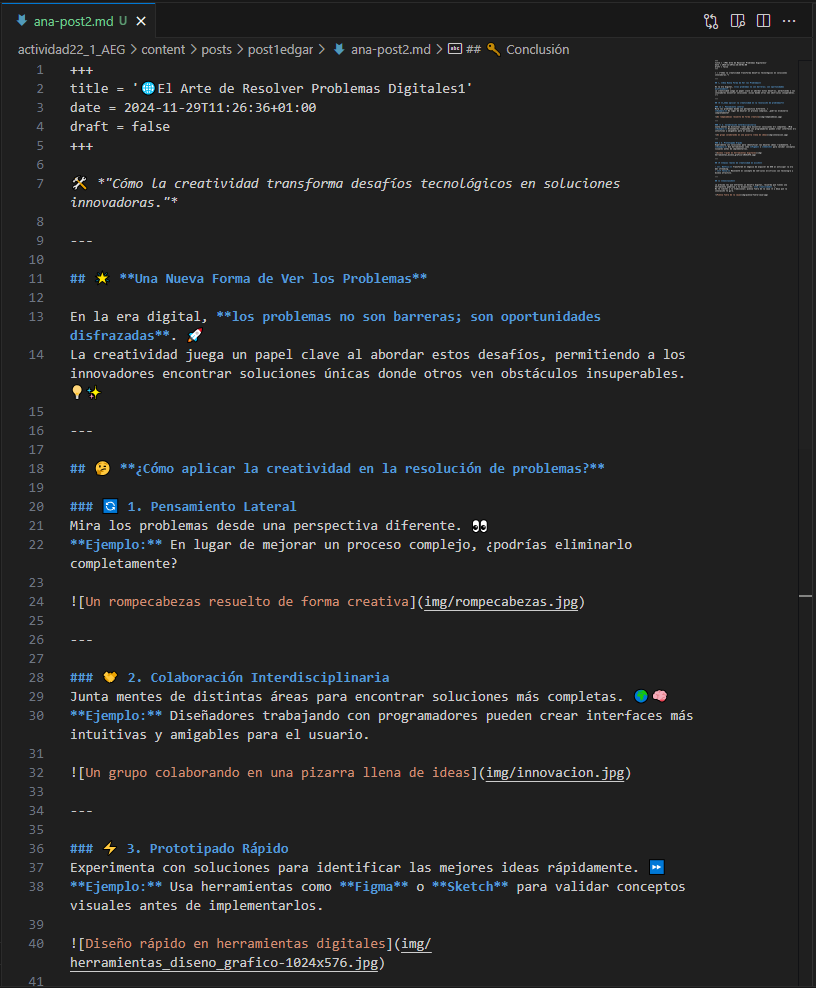
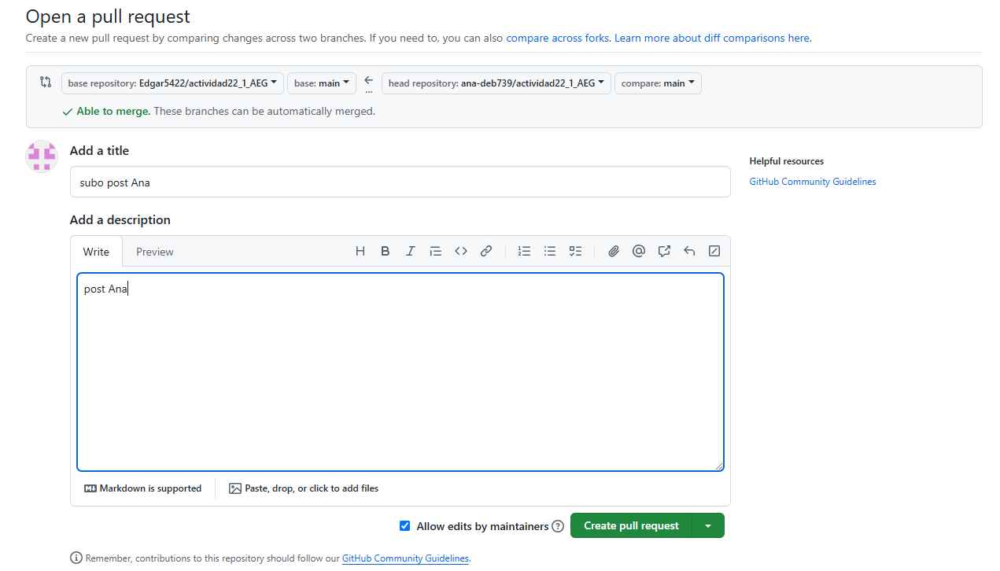

# BIENVENIDOS AL MARKDOWN DE ANA

## Índice

- [Documentación para la Instalación de MkDocs ](#Documentación-para-la-instalación-de-mkdocs)
- [Documentación para inserción de un post en Hugo con el theme de Ananke](#Documentación-para-inserción-de-un-post-en-hugo-con-el-theme-de-ananke)

# Documentación para la Instalación de MkDocs

## Requisitos Previos
Para instalar MkDocs, se necesitan:
- Una versión reciente de **Python**.
- El gestor de paquetes de Python: **pip**.

---

## Pasos para la Instalación

### 1. Actualización del Sistema
Antes de comenzar, actualiza los paquetes del sistema operativo:
```
sudo apt update -y
```
---
### 2. Instalación de Git
Git es necesario para la gestión de repositorios. Instálalo con el siguiente comando:
```
sudo apt install git
```
---
### 3. Instalación de Python y pip
Python y su gestor de paquetes pip son esenciales para trabajar con MkDocs. Instálalos con los comandos:
```
apt install python3
apt install python3-dev python3-pip
```
--- 
### 4. Instalación del Módulo para Entornos Virtuales
Los entornos virtuales permiten mantener las dependencias de los proyectos aisladas. Instala el módulo con:
```
apt install python3.11-venv
```
---
### 5. Creación de un Entorno Virtual

#### 1. Navega a tu carpeta personal donde se creará el entorno virtual:
```
cd /home/usuario
```
#### 2. Crea el entorno virtual:
```
python3 -m venv my-env
```
Esto generará una carpeta llamada `my-env` que contendrá todas las librerías y dependencias de Python para este entorno.

#### 3. Activa el entorno virtual:
```
source my-env/bin/activate
```
#### 4. Nota: Para salir del entorno virtual, usa el comando:
```
source my-env/bin/deactivate
```
 
---
### 6. Instalación de MkDocs
Con el entorno virtual activado, instala MkDocs:
```
apt install mkdocs
```
 
---
### 7. Comprobaciones de Instalación
Realiza las siguientes comprobaciones para verificar que todo está instalado correctamente:

* Verifica la versión de Python:
    ```
    python3 --version
    ```
* Verifica la versión de pip:
    ```
    pip3 --version
    ```
* Verifica la versión de MkDocs:
    ```
    mkdocs --version
    ```
----
### 8. Creación de un Nuevo Proyecto con MkDocs
#### 1. Crea un nuevo proyecto con el siguiente comando:
```
mkdocs new project1
cd project1
```
**Otra opción**
* Crea manualmente un directorio:
    ```
    mkdir project1
    cd project1
    mkdocs new site .
    ```
#### 2. Esto generará un archivo y estructura inicial para tu sitio web de documentación.
 
----

### 9. Configuración de un Repositorio en GitHub
#### 1. Inicializa un repositorio en la carpeta del proyecto:
```
git init
```
#### 2. Conecta tu proyecto con un repositorio remoto en GitHub:
```
git remote add origin https://github.com/ana-deb739/actividad22_3_AEG
```

#### 3. Cambia a la rama principal:
```
git branch -M main
```

#### 3. Realiza un push del contenido al repositorio remoto:
```
git push origin main
```
----
### 10. Modificar el fichero mkdocs
Una vez configurado en local debemos configurar el indice en mkdocs.yml




# Documentación para inserción de un post en Hugo con el theme de Ananke

Primero debemos hacer un fork del reporsitorio de nuestro compañero que se ha encargado de este ejercicio.



Una vez tenemos el fork debemos clonar el repositorio a local. Ya clonado ya podemos empezar a trabajar en él, crear el post e importar las imagenes a utilizar.




Ya terminado el post debemos subir a github el post creado.


Debemos crear el pullrequest y esperar a que nos lo acepte.





Por último comprobamos que se ha compaginado los cambios.


