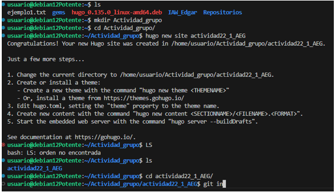
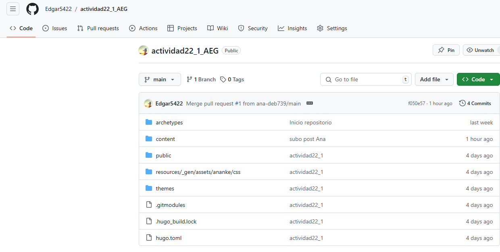

# MARKDOWN DE EXPLICACIÓN DE EDGAR ALUMNO DE ASIR2
# Trabajo realizado por Edgar Díaz Martínez y Ana Diaz
# 🚀 Guía Paso a Paso: Implementación de Sitios Web Estáticos con HUGO y MKDocs 🌐

¡Bienvenidos a esta guía completa! Aquí aprenderás cómo implementar tres tipos de sitios web estáticos utilizando HUGO y MKDocs. Cada sitio tendrá un propósito único y será desplegado en plataformas populares como GitHub Pages, Netlify y Cloudflare. ¡Manos a la obra! 💪

---
# Índice

1. [Introducción](#introducción)  
2. [Tarea 1: Blog Sencillo con HUGO y Ananke](#tarea-1-blog-sencillo-con-hugo-y-ananke)  
   - [Paso 1: Configura tu entorno](#paso-1-configura-tu-entorno)  
   - [Paso 2: Crea un nuevo proyecto](#paso-2-crea-un-nuevo-proyecto)  
   - [Paso 3: Añade el tema Ananke](#paso-3-añade-el-tema-ananke)  
   - [Paso 4: Crea tu contenido](#paso-4-crea-tu-contenido)  
   - [Paso 5: Prueba el sitio](#paso-5-prueba-el-sitio)  
   - [Paso 6: Despliega el sitio](#paso-6-despliega-el-sitio)  
3. [Tarea 2: Sitio Variado con HUGO y PaperMod](#tarea-2-sitio-variado-con-hugo-y-papermod)  
   - [Paso 1: Configura tu entorno](#paso-1-configura-tu-entorno-1)  
   - [Paso 2: Crea un nuevo proyecto](#paso-2-crea-un-nuevo-proyecto-1)  
   - [Paso 3: Añade el tema PaperMod](#paso-3-añade-el-tema-papermod)  
   - [Paso 4: Personaliza el contenido](#paso-4-personaliza-el-contenido)  
   - [Paso 5: Despliega el sitio](#paso-5-despliega-el-sitio-1)  
4. [Tarea 3: Documentación con MKDocs y Material](#tarea-3-documentación-con-mkdocs-y-material)  
   - [Paso 1: Configura tu entorno](#paso-1-configura-tu-entorno-2)  
   - [Paso 2: Crea el sitio](#paso-2-crea-el-sitio)  
   - [Paso 3: Añade el tema Material](#paso-3-añade-el-tema-material)  
   - [Paso 4: Documenta las actividades](#paso-4-documenta-las-actividades)  
   - [Paso 5: Despliega el sitio](#paso-5-despliega-el-sitio-2)  
5. [Conclusión](#conclusión)  

---

# Introducción

En la era de la transformación digital, los sitios web estáticos han resurgido como una solución eficiente y poderosa para crear contenido accesible, seguro y fácil de mantener. Herramientas modernas como **HUGO** y **MKDocs** nos permiten desarrollar sitios web dinámicos en apariencia, pero estáticos en su funcionamiento, ideales para blogs, portfolios o documentación técnica.

Este proyecto consta de tres tareas interconectadas que exploran la implementación y despliegue de sitios web utilizando tecnologías avanzadas y temas visualmente atractivos como **Ananke**, **PaperMod** y **Material**. Cada sitio web está diseñado para cumplir con propósitos específicos, desde blogs creativos hasta documentaciones profesionales, y se despliega en plataformas robustas como **GitHub Pages**, **Netlify** y **Cloudflare**.

En esta guía, aprenderás paso a paso cómo configurar tu entorno, desarrollar los sitios y desplegarlos en línea. Prepárate para explorar una forma innovadora de construir sitios web y documentar tu aprendizaje, mientras das vida a proyectos impactantes que reflejan la esencia de la tecnología y la creatividad. 🚀

---

## 📝 **Tarea 1: Blog Sencillo con HUGO y Ananke**
Un blog estático con el tema **Ananke**, desplegado en **GitHub Pages** y **Netlify**.

---
### 🔧 **Paso 1: Configura tu entorno**
1. Instala [Hugo](https://gohugo.io/getting-started/installing/) en tu sistema.
2. Verifica la instalación con:
   ```bash
   hugo version
   ```
 

 

 

 

---
### 📂 Paso 2: Crea un nuevo proyecto
Crea un nuevo sitio llamado blog-hugo-ananke:
   ```bash
   hugo new site blog-hugo-ananke
   ```


Navega al directorio:
   ```bash
   cd actividad22_1_AEG
   ```
---

### 🎨 Paso 3: Añade el tema Ananke
---

Descarga el tema:
   ```bash
   git init
   ```
   ```bash
   git submodule add https://github.com/theNewDynamic/gohugo-theme-ananke.git themes/ananke
   ```
Configura el tema en config.toml:
toml
theme = "ananke"

---
### ✍️ Paso 4: Crea tu contenido
Genera tu primer post:
   ```bash
   hugo new posts/primer-post.md
   ```


Edita el contenido en content/posts/primer-post.md.

---
### 🔍 Paso 5: Prueba el sitio
Inicia un servidor local:
   ```bash
   hugo server
   ```


Accede a http://localhost:1313 para visualizar el sitio.


---
### ☁️ Paso 6: Despliega el sitio
- GitHub Pages:
Crea un repositorio en GitHub.
- Añade los archivos y haz un push:
   ```bash
   git add .
   git commit -m "Initial commit"
   git branch -M main
   git remote add origin https://github.com/tu_usuario/blog-hugo-ananke.git
   git push -u origin main
   ```


Configura GitHub Pages desde la rama main.

Netlify:

- Crea una cuenta en Netlify.
- Conecta el repositorio y selecciona el directorio public/ como carpeta de publicación.

---

### 🌟 Tarea 2: Sitio Variado con HUGO y PaperMod
Un sitio estático con temática variada, usando el tema PaperMod, desplegado en GitHub Pages y Cloudflare.

---

### 🔧 Paso 1: Configura tu entorno
(Similar al Paso 1 de la Tarea 1).

### 📂 Paso 2: Crea un nuevo proyecto
Crea un sitio llamado sitio-variante:
bash
Copiar código
hugo new site sitio-variante
### 🎨 Paso 3: Añade el tema PaperMod
Descarga el tema:
bash
Copiar código
git submodule add https://github.com/adityatelange/hugo-PaperMod themes/PaperMod
Configura el tema en config.toml:
toml
Copiar código
theme = "PaperMod"
### 🛠️ Paso 4: Personaliza el contenido
Crea secciones variadas como "Portfolio", "Blog" o "Recetas".
Usa hugo new para añadir contenido.
### ☁️ Paso 5: Despliega el sitio
GitHub Pages:
Sigue los mismos pasos que en la Tarea 1.
Cloudflare Pages:
Crea una cuenta en Cloudflare Pages.
Conecta tu repositorio y selecciona el directorio public/.

---
## 📘 Tarea 3: Documentación con MKDocs y Material
Un sitio estático que documenta las actividades, basado en MKDocs y el tema Material, desplegado en GitHub Pages y Cloudflare.

---

### 🔧 Paso 1: Configura tu entorno
---

Instala MKDocs en tu sistema:
```
pip install mkdocs
```
Verifica la instalación:
```
mkdocs --version
```
---
### 📂 Paso 2: Crea el sitio
---
Genera un proyecto nuevo:
```
mkdocs new actividad2_2
cd actividad2_2
```
---

### 🎨 Paso 3: Añade el tema Material
---

Instala el tema:
```
pip install mkdocs-material
```

Configura el tema en mkdocs.yml:
yaml
```
theme:
  name: material
```
---
### ✍️ Paso 4: Documenta las actividades
---
Edita los archivos en el directorio docs/ para documentar las tareas.

---
### ☁️ Paso 5: Despliega el sitio
---
GitHub Pages:
Configura GitHub Pages para el repositorio.
Genera el sitio:
```
mkdocs gh-deploy
```
Cloudflare Pages:
Publica los archivos estáticos generados en site/.

---

# ✅ Conclusión
Con estas instrucciones, ahora puedes implementar y desplegar tres sitios web estáticos profesionales y variados. Desde blogs hasta documentaciones técnicas, estas herramientas te permitirán crear contenido visualmente atractivo y funcional. ¡Explora tu creatividad y comparte tus proyectos con el mundo! 🌍✨

---
